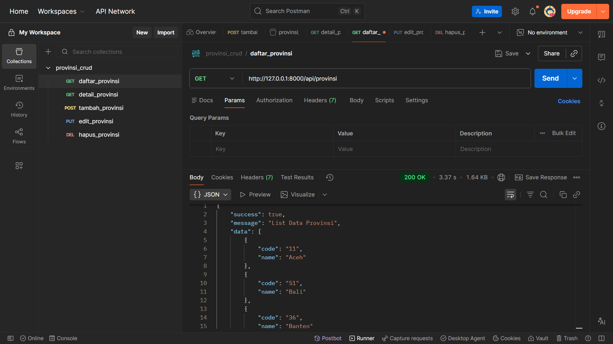
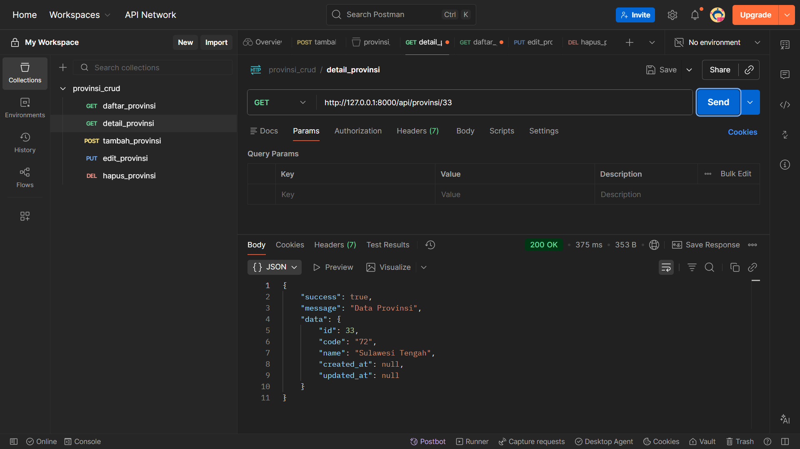
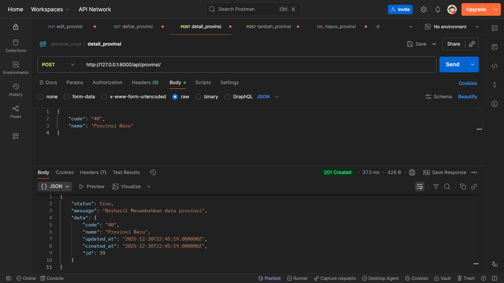
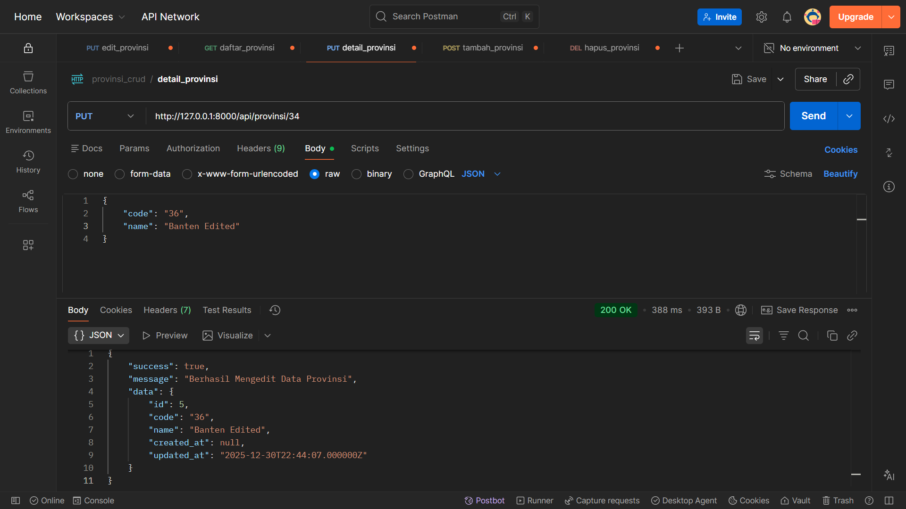
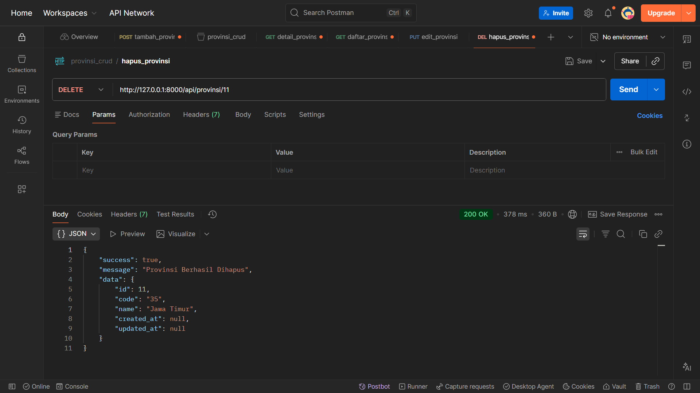

<div align="center">

# 🇮🇩 IndoProvince REST API


**Backend Service untuk Manajemen Data Provinsi di Indonesia.** *Studi Kasus Seleksi Magang - Mobile Developer - PT TATI Indonesia*

[Instalasi](#-instalasi) • [Dokumentasi API](#-dokumentasi-api) • [Pengujian](#-hasil-pengujian)

</div>

---

## 📖 Tentang Project

Project ini adalah **RESTful API** yang dibangun menggunakan framework **Laravel**. API ini menyediakan layanan CRUD (Create, Read, Update, Delete) untuk data provinsi di Indonesia. Dirancang dengan prinsip *Clean Code*, validasi data yang ketat, dan format respons JSON yang konsisten (`status`, `message`, `data`) untuk memudahkan integrasi dengan Frontend (Flutter).

### ✨ Fitur Utama
* ✅ **CRUD Lengkap** untuk data Provinsi.
* ✅ **Validasi Data** yang kuat (Unique Code, Required Fields).
* ✅ **Standard Response** menggunakan API Resources.
* ✅ **Error Handling** yang informatif (404 Not Found, 422 Unprocessable Entity).

---

## 🛠 Instalasi & Menjalankan

Ikuti langkah berikut untuk menjalankan project di local machine Anda.

**Prerequisites:**
* PHP >= 8.1
* Composer
* MySQL

### 1. Clone Repository
```bash
git clone [https://github.com/MCat-arch/Test-ProgrammerTATI-KhoerunnisaUtami](https://github.com/MCat-arch/Test-ProgrammerTATI-KhoerunnisaUtami)
cd repo-name
```
### 2. Installasi
```bash
composer install
```
Buka file .env dan sesuaikan DB_DATABASE=mysql dan DB_USERNAME

Kemudian Migrate table dan jalankan server

```bash
php artisan migrate

php artisan serve
```
### 📡 Daftar Endpoint

**Base URL:** `http://127.0.0.1:8000/api`

| Method | Endpoint | Deskripsi | Body (JSON) |
| :--- | :--- | :--- | :--- |
| **GET** | `/provinsi` | Menampilkan semua provinsi | - |
| **GET** | `/provinsi/{code}` | Detail provinsi by code | - |
| **POST** | `/provinsi` | Tambah provinsi baru | `code`, `name` |
| **PUT** | `/provinsi/{code}` | Update data provinsi | `code`, `name` |
| **DELETE** | `/provinsi/{id}` | Hapus provinsi by ID | - |

> **Catatan:** Pastikan menyertakan Header `Accept: application/json` pada setiap request agar response error validasi berupa JSON.


### 📸 Bukti Pengujian (Postman)
Berikut adalah tangkapan layar hasil pengujian fungsionalitas CRUD.

<table> <tr> <td align="center"><b>1. List Semua Data (Index)</b></td> <td align="center"><b>2. Detail Data (Show)</b></td> </tr> <tr> <td></td> <td></td> </tr> <tr> <td align="center"><b>3. Tambah Data (Create)</b></td> <td align="center"><b>4. Edit Data (Update)</b></td> </tr> <tr> <td></td> <td></td> </tr> </table>

<div align="center"> <b>5. Hapus Data (Delete)</b>


 </div>

<div align="center"> <p>Dikembangkan dengan ❤️ menggunakan Laravel untuk seleksi intern PT TATI</p> </div>