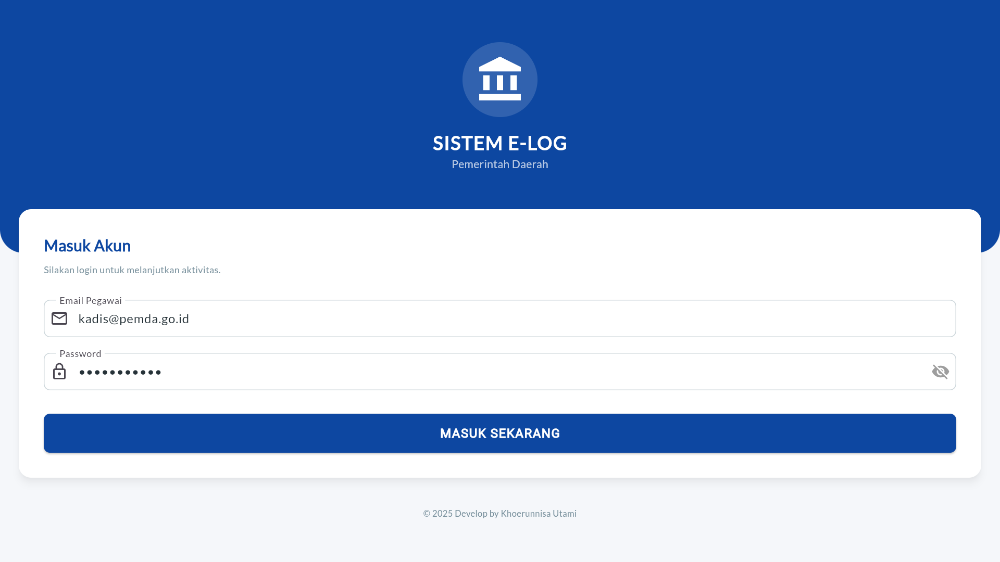
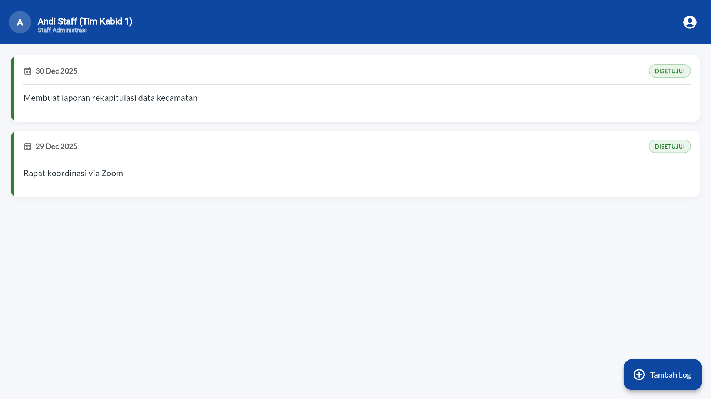
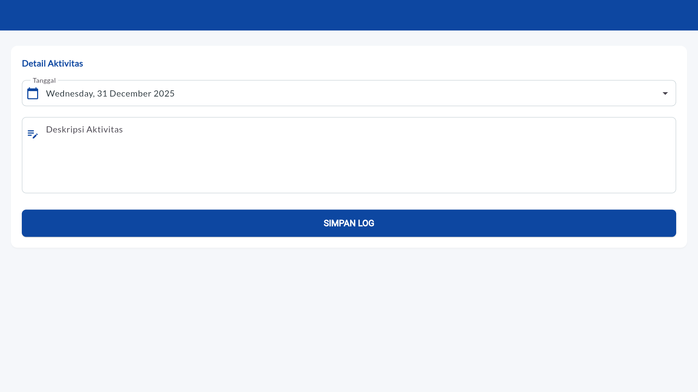
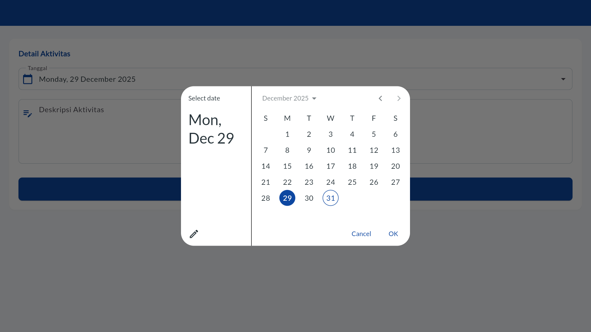
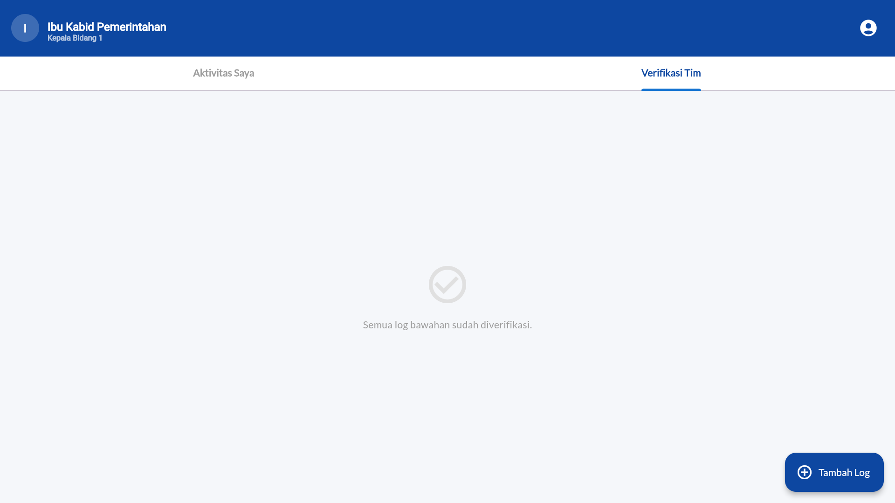
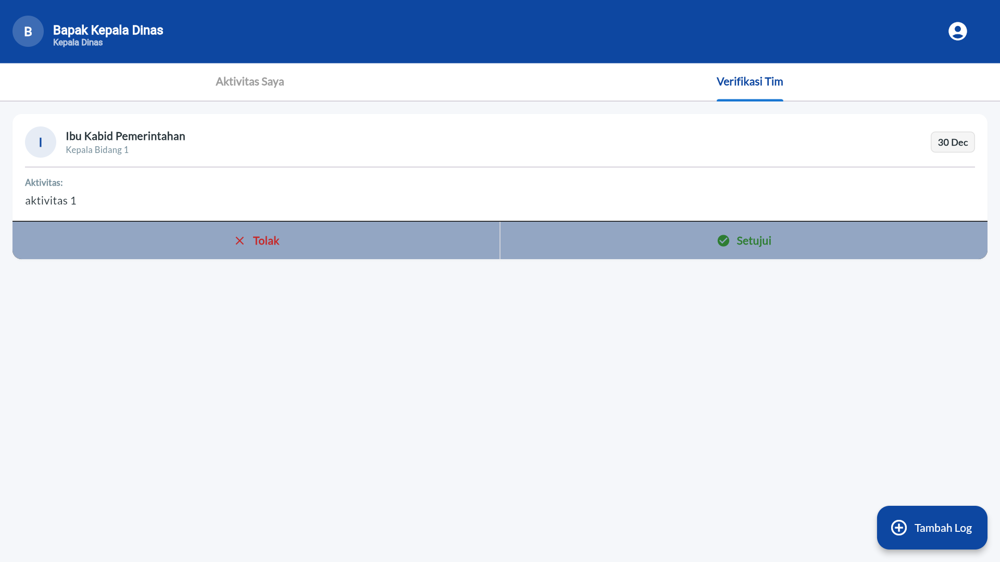
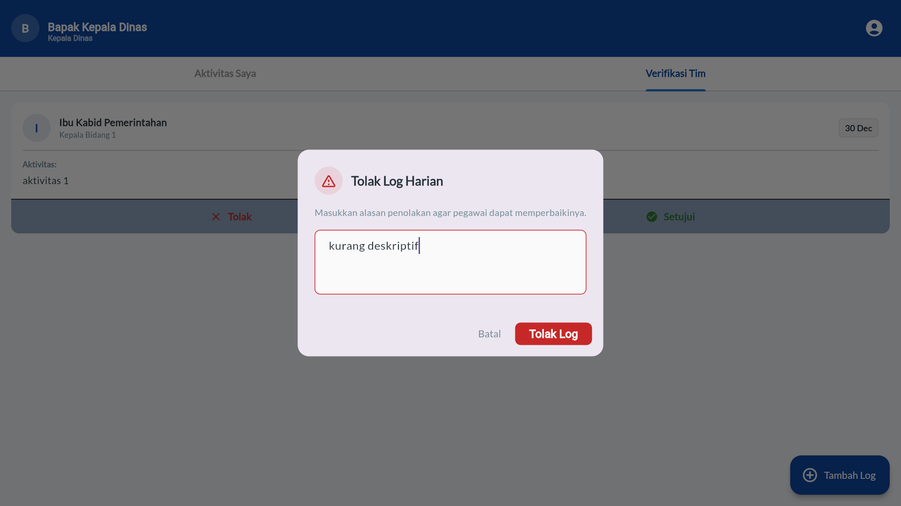
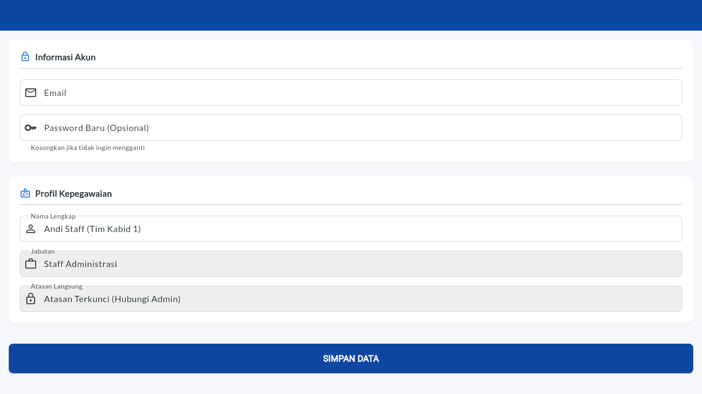

# 🏛️ E-LOG Pemda (Sistem Informasi Log Harian Pegawai)

**E-LOG Pemda** adalah aplikasi mobile/web berbasis **Flutter** dan **Laravel** yang dirancang untuk mempermudah pencatatan, pemantauan, dan verifikasi kinerja harian pegawai di lingkungan Pemerintahan Daerah. Aplikasi ini menerapkan sistem hierarki kepegawaian untuk validasi berjenjang.

---

## 🛠️ Tech Stack

### Backend (API)
* **Framework:** Laravel 11/12 (PHP 8.2+)
* **Auth:** Laravel Sanctum (Bearer Token)
* **Database:** MySQL
* **Features:** REST API, Eloquent Relationships (Recursive for Hierarchy), Database Seeder.

### Frontend (Mobile/Web)
* **Framework:** Flutter (Dart)
* **State Management:** Provider
* **Architecture:** MVVM (Model-View-ViewModel) pattern
* **Styling:** Custom Enterprise Theme (Google Fonts Lato, Royal Blue Palette)
* **Networking:** HTTP Package

---

## 🏗️ Arsitektur & Best Practices (Flutter)

Proyek ini dibangun dengan prinsip *Clean Code* dan efisiensi pengembangan menggunakan pendekatan berikut:

### 1. Reusable Form Strategy (Smart Widgets) 💡
Kami tidak memisahkan halaman *Create* dan *Update*. Sebaliknya, kami menggunakan **Satu Widget Form** pintar yang beradaptasi berdasarkan parameter yang diterima.
* **Logic:** Jika parameter data `null`, form berjalan dalam mode **Create**. Jika data ada, form mengisi otomatis field (Pre-filled) dan berjalan dalam mode **Edit**.
* **Benefit:** Mengurangi duplikasi kode hingga 50% dan mempermudah *maintenance* validasi.

### 2. MVVM with Provider 🔄
Pemisahan logika bisnis dari UI untuk menjaga kode tetap modular.
* **Model:** Struktur data JSON (misal: `LogModel`, `PegawaiModel`).
* **Service:** Menangani request HTTP ke API Laravel.
* **Provider (ViewModel):** Mengelola *state* aplikasi (Loading, List Data, Error Handling) dan menjembatani UI dengan Service.
* **View (UI):** Fokus hanya pada tampilan dan memanggil fungsi di Provider.

### 3. Modular UI Components 🧩
Memecah tampilan kompleks menjadi widget kecil yang dapat digunakan kembali, seperti:
* `VerificationCard`: Kartu khusus untuk atasan melakukan approval.
* `LogCardWidget`: Kartu tampilan log standar untuk staff.
* `ValidationDialog`: Pop-up validasi reusable untuk input alasan penolakan.

---

## 👥 Role & Hak Akses (RBAC)

Aplikasi ini memiliki sistem otorisasi ketat berdasarkan peran pengguna:

| Fitur | 👑 Kepala Dinas (Kadis) | 👔 Kepala Bidang (Kabid) | 👷 Staff |
| :--- | :---: | :---: | :---: |
| **Input Log Harian** | ✅ | ✅ | ✅ |
| **Edit Profil Sendiri** | ✅ (Full Akses) | ✅ (Terbatas) | ✅ (Terbatas) |
| **Tambah Pegawai Baru**| ✅ | ❌ | ❌ |
| **Lihat Log Bawahan** | ✅ (Semua Bidang) | ✅ (Staff Bidangnya) | ❌ |
| **Verifikasi (Approve/Reject)** | ✅ | ✅ | ❌ |
| **Edit Jabatan/Role User** | ✅ | ❌ | ❌ |

> **Catatan:** Form Edit Profil bersifat adaptif. Hanya *Kepala Dinas* yang bisa melihat dan mengedit field sensitif seperti "Jabatan", "Atasan", dan "Role". Role lain hanya bisa mengedit Nama, Email, dan Password.

---

## 📸 Tampilan Aplikasi (Gallery)

### 1. Autentikasi & Dashboard
| Login Screen | Dashboard Staff |
| :---: | :---: |
|  <br> *Desain Login Enterprise* |  <br> *Dashboard Staff dengan Status Log* |

### 2. Manajemen Log Harian
| Input Log (Staff) | Input Log (Kadis) |
| :---: | :---: |
|  <br> *Form Input Aktivitas Harian* |  <br> *Tampilan Input untuk Pimpinan* |

### 3. Sistem Verifikasi (Approval)
| Verifikasi (View Kabid) | Verifikasi (View Kadis) | Reject Log |
| :---: | :---: | :---: |
|  <br> *Kabid memverifikasi Staff* |  <br> *Kadis memverifikasi Kabid* |  <br> *Dialog Alasan Penolakan* |

### 4. Manajemen Profil
| Edit Profil (Staff) |
| :---: |
|  <br> *Field Jabatan Terkunci (Read-Only)* |

---

## 🚀 Instalasi & Menjalankan Aplikasi

Ikuti langkah berikut untuk menjalankan proyek di komputer lokal Anda.

### Prasyarat
* PHP >= 8.2 & Composer
* Flutter SDK
* MySQL Database

### 1. Setup Backend (Laravel)
```bash
# Clone Repository
git clone [https://github.com/MCat-arch/Test-ProgrammerTATI-KhoerunnisaUtami](https://github.com/MCat-arch/Test-ProgrammerTATI-KhoerunnisaUtami)
cd tati_tes

# Install Dependencies
composer install

# Setup Environment
cp .env.example .env
# (Konfigurasi DB_DATABASE, DB_USERNAME, DB_PASSWORD di file .env)

# Generate Key & Migrate
php artisan key:generate
php artisan migrate:fresh --seed 

# Jalankan Server
php artisan serve 
```
### 1. Setup Frontend (Flutter)

```bash
# Masuk ke folder flutter
cd tati_frontend

# Install Dependencies
flutter pub get

# Jalankan Aplikasi
flutter run
```

### 🔐 Akun Demo (Seeder)
Jika menjalankan php artisan migrate --seed, gunakan akun berikut untuk testing:

Kepala Dinas: kadis@pemda.go.id / password123

Kepala Bidang: kabid1@pemda.go.id / password123

Staff: staff1@pemda.go.id / password123


Built with ❤️ using Flutter & Laravel.
